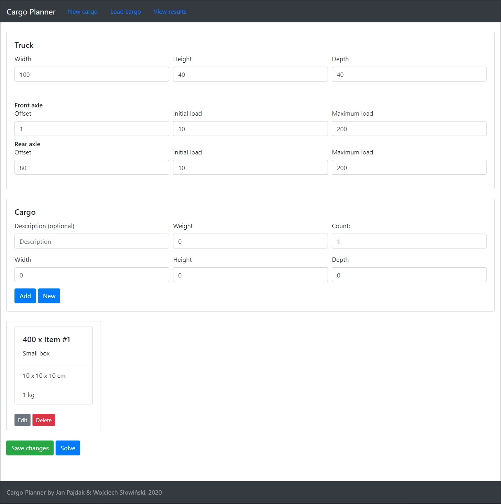
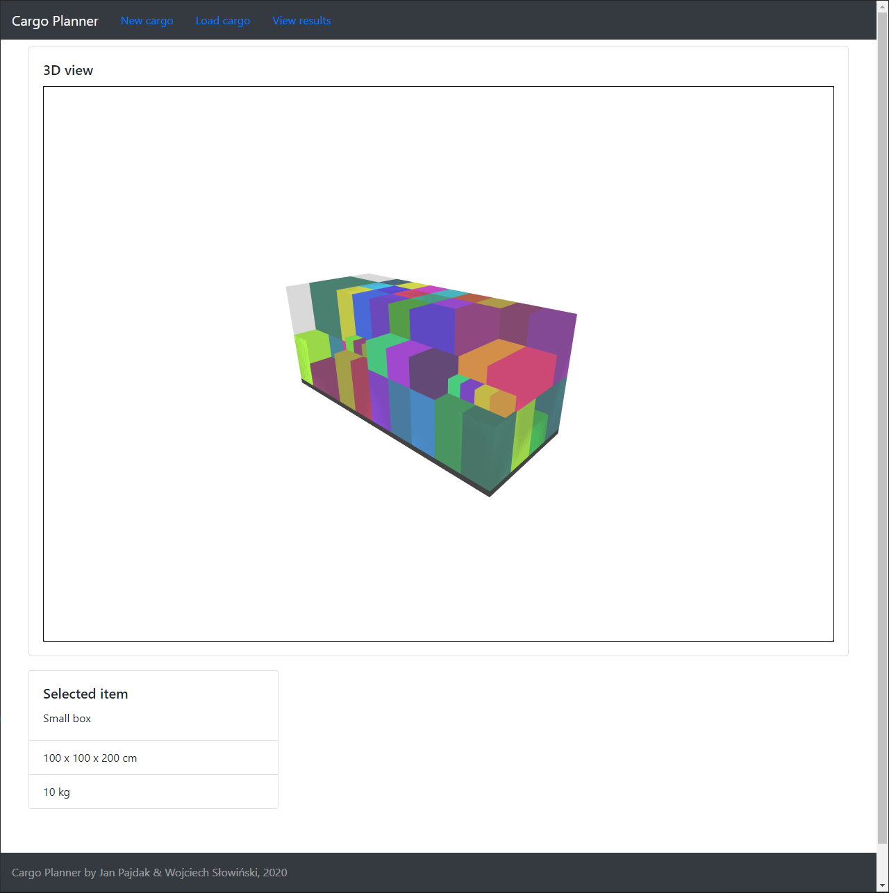

# cargo-planner

## Summary

Cargo load optimization solution developed together with [dabljues](https://github.com/dabljues) as part of our master thesis. In short: user defines cargo (list of items with their dimensions), truck size and starts the algorithm. After a short while, 3D view of solution is presented, with basic interactive features such as camera movement or selecting an item to display its details. Simple axle load calculation is also done, in order to not load too many items than the trailer can handle.

## Technology

Backend is a REST API using ASP.NET Core 3, coupled to CosmosDB database. Some of the frameworks used: AutoMapper, Entity Framework Core, NUnit and Swashbuckle for documentation.

Frontend is using React with TypeScript. The most important frontend libraries are three-js and react-three-fiber, providing 3D rendering capability.

## To-do

Project can be polished in many areas, as we focused on getting the algorithm and 3D display working rather than making UI and boilerplate code look nice. It was my first attempt at using React and I've grown to like it, in the future I'll try to learn it at a better level.

Some of the things I plan to fix when I have time (after my thesis defense):

- Cleaning up React code, as some modules have awful amount of code that should be split into different files. I'll refine some logic while doing it, in order to get a better grasp of React. Too many parameters are passed in routes (like truck id in result view) as well and this has to be improved, its an ugly way to do it, but fast solution was needed at the time.
- Cleaning up some classes related to algorithm calculation, moving logic into separate classes, in order to make data model classes clean & simple.
- Creating a streamlined version of application that runs without database - just cargo definition & result display. This will allow to host it for free, as database is the only part generating costs on Azure.
- Finish working on authorization; this feature wasn't completed properly. I've done backend authorization few times before, so that's not a problem, however, I've yet to learn how to do it properly in React (I plan to learn Redux while doing that).

## Images

